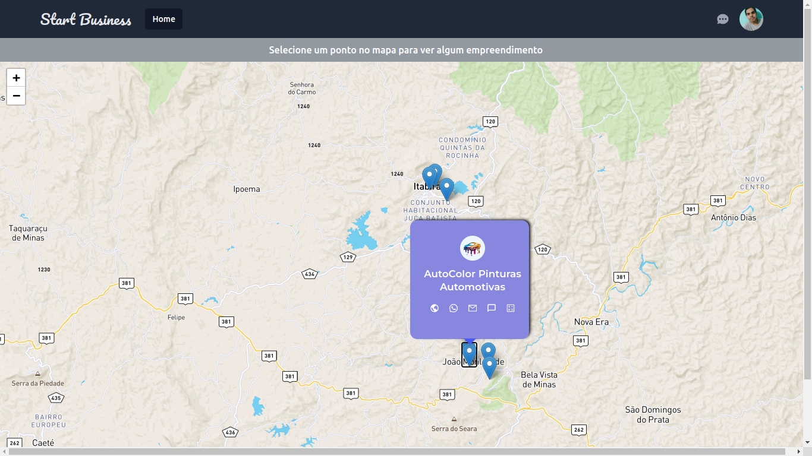
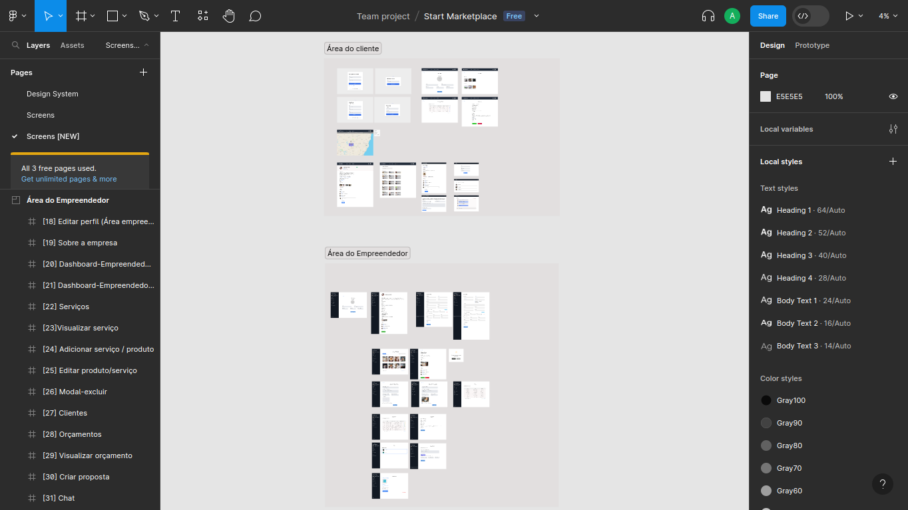

# Trabalho de conclusão de curso (TCC)
Projeto desenvolvido como parte trabalho de conclusão de curso (TCC) do curso de Sistemas de Informação - UFOP.




### 📌 **Indíce**

- [📄 Sobre o projeto](#-sobre-o-projeto)
- [🧑‍💻 Tecnologias utilizadas](#-tecnologias-utilizadas)
- [🎨 Layout da aplicação](#-layout-da-aplicação)
- [🚀 Funcionalidades](#-funcionalidades)
- [⚙ Como executar a aplicação](#-como-executar-a-aplicação)
- [🌍 Deploy da aplicação](#-deploy-da-aplicação)
- [🤝 Como contribuir](#-como-contribuir)
- [📝 Licença](#-licença)
- [👥 Autor](#-autor)

## 📄 Sobre o projeto

Esse projeto tem como objetivo auxiliar os microempreendedores individuais (MEIs) a 
divulgarem seus negócios e serviços. A plataforma possibilita uma maior aproximação com o
público-alvo, ampliando o alcance e potencializando oportunidades de crescimento.

## 🧑‍💻 Tecnologias utilizadas

Para a implementação do front-end, foi utilizada como linguagem de programação o TypeScript, junto com a biblioteca do React.js e alguns frameworks, listados abaixo:


[](https://developer.mozilla.org/pt-BR/docs/Learn/HTML)
[](https://developer.mozilla.org/pt-BR/docs/Learn/CSS)
[](https://react.dev/)
[](https://tailwindcss.com/)
[](https://vitejs.dev/)
[](https://sass-lang.com/)

## 🎨 Layout da aplicação



Confira o design da aplicação no [Figma](https://www.figma.com/file/TTGQPpAVEUs8ZEKbFAPYlb/Start-Marketplace?type=design&node-id=1101%3A1069&mode=design&t=OH2RvYnQHQs8IxSO-1).

Para acessar, é necessário ter uma conta no Figma. [Crie aqui](https://www.figma.com/login).

## 🚀 Funcionalidades

- Cadastro e autenticação de usuários
- Listagem e pesquisa de serviços
- Favoritar e avaliar serviços
- Solicitação e gerenciamento de orçamentos
- Sistema e chat para comunicação entre clientes e MEIs
- Gerenciamento de perfil dos usuários

## ⚙ Como executar a aplicação
Antes de executar a aplicação, certifique que você tenha uma versão LTS do Node.js e npm instalados.

Para executar a aplicação siga os seguintes passos:

1. Clone o repositório:
    ```
    git clone https://github.com/andersondev96/start-business-client
    ```
2. Abra o terminal e acesse a pasta `start-buisness-client` com o comando `cd start-business-client`.

3. Instale as dependências do projeto:
    ```
    npm install # ou pnpm install
    ```
4. Configure as variáveis de ambiente:
      ```
    VITE_APP_ENV=local
    VITE_API_LOCAL='http://localhost:3333'
    VITE_ACCESS_TOKEN_MAP_BOX=your-vite-access-token-map-box
    VITE_GOOGLE_MAPS_API_KEY=your-vite-google-maps-api-key
   ```
5. Com tudo configurado você poderá acessar a aplicação com o comando:
    ```
    npm run dev ou pnpm run dev
    ```
6. A aplicação será executada na porta `3000`do servidor.  Para acessar a interface abra um navegador de sua preferência e acesse essa url: [http://localhost:3000](http://localhost:3000).

7. Lembrando que para que a aplicação esteja funcionando corretamente, o servidor node deve estar sendo executado, para isso é necessário clonar a aplicação node e seguir todas as instruções para a sua configuração. 
A aplicação node está no seguinte repositório: [Servidor Node](https://github.com/andersondev96/start-business-api).

## 🌍 Deploy da aplicação
A aplicação está disponível online no seguinte endereço:
[https://start-business-client.vercel.app/](https://start-business-client.vercel.app/).

O deploy da aplicação foi feito utilizando o [Vercel](https://vercel.com/).

## 🤝 Como contribuir
1. Faça um fork do repositório.

2. Crie uma nova branch com as suas alterações:
    ```
    git checkout -b my-feature
    ```
3. Salve as suas alterações e crie uma mensagem de commit, dizendo o que você fez: 
    ```
    git commit -m "feature: My new feature"
    ```
4. Envie as suas alterações: 
    ```
    git push origin my-feature
    ```

## 📝 Licença
 Este projeto está sobre a licença [MIT](LICENSE).

## 👥 Autor

<div style="display:flex; flex-direction:column; align-items: center;">

<a href="https://www.linkedin.com/in/anderson-fernandes96/">

</a>

**Anderson Fernandes Ferreira**

[](https://instagram.com/anderson_ff13)
[](mailto:andersonfferreira96@gmail.com.br)
[](https://www.linkedin.com/in/anderson-fernandes96/)

---

Feito com 💚 por **Anderson Fernandes** 👋 
[Entre em conanto](https://www.linkedin.com/in/anderson-fernandes96/)

</div>
